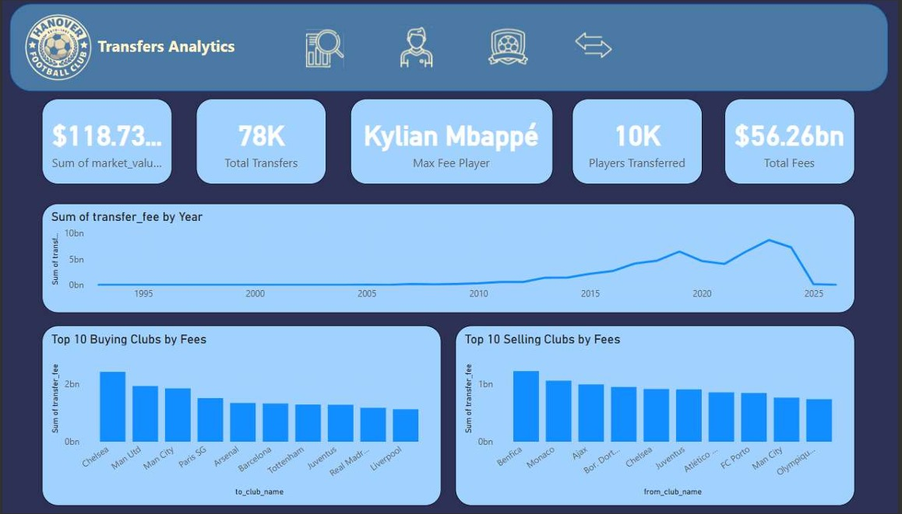

# Football Intelligence Dashboard

A comprehensive Power BI dashboard showcasing football performance metrics, transfers, and player statistics.

## Dashboard Sections:
- **Overview**: 40K games, 1.66M mins played, 2M appearances
- **Player Analytics**: Avg. age 31, assists, goals, market value
- **Club Analytics**: Goals, wins, map distribution, seasonal performance
- **Transfers**: 78K transfers, $56.26B fees, Mbappé as top transfer

## Tools Used:
- Power BI
- Custom visuals
- Geographic mapping

